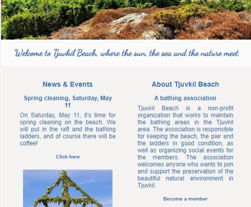
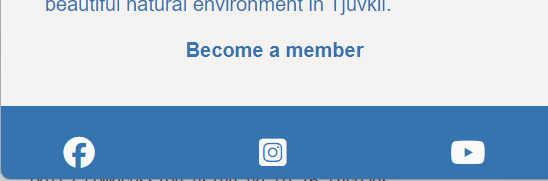

<h1 align="center">Tjuvkil Beach</h1>

[View the live project here.](https://sofianords.github.io/beach-club/)

This is Tjuvkil’s Bathing Association’s website. It is intended for its members, potential members, and others who want to find information about the association. The board of the association can easily reach out with news and information about upcoming events on this easy-to-navigate site that works on a range of devices.

<h2 align="center"></h2>

## User Experience (UX)

-   ### User stories

    -   #### First Time Visitor Goals

        1. As a First Time Visitor, I want to easily understand the main purpose of the site and learn more about the association.
        2. As a First Time Visitor, I want to be able to easily navigate throughout the site to find information.
        3. As a First Time Visitor, I would like to find links to social media to learn more about the community in the association and get an idea of what it’s like to be a member.
        4. As a First Time Visitor, I want to know how I become a member of the association, what it means to be a member and what is expected of me as a member if I become one.

    -   #### Returning Visitor Goals

        1. As a Returning Visitor, I want to find information about news and events in the association.
        2. As a Returning Visitor, I want to find the best way to get in contact with the organisation with any questions I may have.
        3. As a Returning Visitor, I want to find community links.

    -   #### Frequent User Goals
        1. As a Frequent User, I want to check to see if there are any newly added events to participate in.
        2. As a Frequent User, I want to check to see if there are any news about the bathing areas.
        3. As a Frequent User, I want to be able to ask questions and make suggestions to the board.

-   ### Design
    -   #### Colour Scheme
        -   The two main colours used are (#03574B) cyan-blue and rgb(245, 242, 242) representing a very light shade of gray. I captured the colors from the hero image using Paint. 
    -   #### Typography
        -   The ?  font is the main font used throughout the whole website with Sans Serif as the fallback font in case for any reason the font isn't being imported into the site correctly. Montserrat is a clean font used frequently in programming, so it is both attractive and appropriate.
    -   #### Imagery
        -   Imagery is important. The large, background hero image is designed to be striking and catch the user's attention. It also has a modern, energetic aesthetic.

*   ### Wireframes

    -   Home Page Wireframe - [View](https://github.com/)

    -   Mobile Wireframe - [View](https://github.com/)

    -   Contact Us Page Wireframe - [View](https://github.com/)

## Features

- The landing page 

    The first thing the user encounters is a large picture of Tjuvkil Beach on a beautiful summer day when the beach is at its best. The image should convey a feeling of wanting to be there.

    
- The navbar

    The navbar is clear and consistent with the design. It indicates that you are on the home page by highlighting the home page. If you switch to another page, such as Contact, that page will be highlighted instead. 

- Content first page

    Just below the large picture of Tjuvkil Beach, there is a brief summary of current news and events, as well as links to the News & Events page so that you can quickly navigate and read the entire article. Next to it, you will find an explanation, “About Tjuvkil Beach”, which describes the association’s purpose and goals.

    

    If the user clicks on the “Become a member” link, they will be taken to the “Contact” page where they can write a message and check the box to become a member.

- Footer and social media icons

   The footer is designed to be consistent with the overall look and feel of the site, and it provides easy access to social media links. The footer is fixed in place, so users will always see the links as they navigate the site. 

    


- Links
- Form   
Responsive on all device sizes

-   Interactive elements

- Buttons with hover feature

## Technologies Used

### Languages Used

-   [HTML5](https://en.wikipedia.org/wiki/HTML5)
-   [CSS3](https://en.wikipedia.org/wiki/Cascading_Style_Sheets)

### Frameworks, Libraries & Programs Used

1. [Hover.css:](https://ianlunn.github.io/Hover/)
    - Hover.css was used on the Social Media icons in the footer to add the float transition while being hovered over.
1. [Google Fonts:](https://fonts.google.com/)
    - Google fonts were used to import the 'Titillium Web' font into the style.css file which is used on all pages throughout the project.
1. [Font Awesome:](https://fontawesome.com/)
    - Font Awesome was used on all pages throughout the website to add icons for aesthetic and UX purposes.
1. [jQuery:](https://jquery.com/)
    - jQuery came with Bootstrap to make the navbar responsive but was also used for the smooth scroll function in JavaScript.
1. [Git](https://git-scm.com/)
    - Git was used for version control by utilizing the Gitpod terminal to commit to Git and Push to GitHub.
1. [GitHub:](https://github.com/)
    - GitHub is used to store the projects code after being pushed from Git.
1. [Photoshop:](https://www.adobe.com/ie/products/photoshop.html)
    - Photoshop was used to create the logo, resizing images and editing photos for the website.
1. [Balsamiq:](https://balsamiq.com/)
    - Balsamiq was used to create the [wireframes](https://github.com/) during the design process.

## Testing

The W3C Markup Validator and W3C CSS Validator Services were used to validate every page of the project to ensure there were no syntax errors in the project.

-   [W3C Markup Validator](https://jigsaw.w3.org/css-validator/#validate_by_input) - [Results](https://github.com/)
-   [W3C CSS Validator](https://jigsaw.w3.org/css-validator/#validate_by_input) - [Results](https://github.com/)

### Testing User Stories from User Experience (UX) Section

-   #### First Time Visitor Goals

    1. As a First Time Visitor, I want to easily understand the main purpose of the site and learn more about the association.

        1. On the first page, the users are greeted by a large picture of Tjuvkil Beach and a clear navigation bar where the user can navigate to the News & Event and Contact pages. 
        
        2. Below the large picture, there is also a summary of the latest news and an "About-section" where you can read about the bathing association. 
    

    2. As a First Time Visitor, I want to be able to easily navigate throughout the site to find information.

        1. At the top of each page there is a clean navigation bar where each link describes what the page they will end up at clearly.
        
        2. In the summary of the latest news in the first page there are links from each news to the "News and Event-page". 
        
        3. Right under the "About-section" at the first page there is a link named "Become a member" which leads to the contact-page where the visitor can check a checkbox to become a member while sending a message.

    3. As a First Time Visitor, I would like to find links to social media to learn more about the community in the association and get an idea of what it’s like to be a member.
        1. The footer on all pages contains links to social media where visitors can read about and view pictures of the association, including movies, as well as the community within it. It’s clear that there’s a strong sense of unity and that everyone helps each other to the best of their ability.

-   #### Returning Visitor Goals

    1. As a Returning Visitor, I want to find information about news and events in the association.

        1. In the summary of the latest news in the first page there are links from each news to the "News and Event-page".

        2. At the top of each page there is a clear navigation bar where the link to the "News and Events-page" is named "News and Events"

    2. As a Returning Visitor, I want to find the best way to get in contact with the organisation with any questions I may have.

        1. The navigation bar clearly highlights the "Contact Us" Page.
        2. Here they can fill out the form on the page or are told that alternatively they can message the organisation on social media.
        3. The footer contains links to the organisations Facebook, Twitter and Instagram page as well as the organization's email.
        4. Whichever link they click, it will be open up in a new tab to ensure the user can easily get back to the website.
        5. The email button is set up to automatically open up your email app and autofill there email address in the "To" section.

     3. As a Returning Visitor, I want to find community links.
        1. The Facebook Page can be found at the footer of every page and will open a new tab for the user and more information can be found on the Facebook page.
        2. Alternatively, the user can scroll to the bottom of the Home page to find the Facebook Group redirect card and can easily join by clicking the "Join Now!" button which like any external link, will open in a new tab to ensure they can get back to the website easily.
        3. If the user is on the "Our Favourites" page they will also be greeted with a call to action button to invite the user to the Facebook group. The user is incentivized as they are told there is a weekly favourite product posted in the group.

-   #### Frequent User Goals

     1. As a Frequent User, I want to check to see if there are any newly added events to participate in.

        1. The user would already be comfortable with the website layout and can easily click the banner message.

    2. As a Frequent User, I want to check to see if there are any news about the bathing areas.

        1. The user would already be comfortable with the website layout and can easily click the blog link

     3. As a Frequent User, I want to be able to ask questions and make suggestions to the board.

        1. At the bottom of every page their is a footer which content is consistent throughout all pages.
        2. To the right hand side of the footer the user can see "Subscribe to our Newsletter" and are prompted to Enter their email address.
        3. There is a "Submit" button to the right hand side of the input field which is located close to the field and can easily be distinguished.

### Further Testing

-   The Website was tested on Google Chrome, Internet Explorer, Microsoft Edge and Safari browsers.
-   The website was viewed on a variety of devices such as Desktop, Laptop, iPhone7, iPhone 8 & iPhoneX.
-   A large amount of testing was done to ensure that all pages were linking correctly.
-   Friends and family members were asked to review the site and documentation to point out any bugs and/or user experience issues.

### Known Bugs

-   On the mobile device Galaxy Fold the width of the body turn out to be 280px while the page is 335px. I investigated this and got this from Tutor Assictance which seems to be the reason:

    https://stackoverflow.com/questions/64886134/what-is-chromes-galaxy-fold-responsive-view-based-on


## Deployment

### GitHub Pages

The project was deployed to GitHub Pages using the following steps...

1. Log in to GitHub and locate the [GitHub Repository](https://github.com/)
2. At the top of the Repository (not top of page), locate the "Settings" Button on the menu.
    - Alternatively Click [Here](https://raw.githubusercontent.com/) for a GIF demonstrating the process starting from Step 2.
3. Scroll down the Settings page until you locate the "GitHub Pages" Section.
4. Under "Source", click the dropdown called "None" and select "Master Branch".
5. The page will automatically refresh.
6. Scroll back down through the page to locate the now published site [link](https://github.com) in the "GitHub Pages" section.

### Forking the GitHub Repository

By forking the GitHub Repository we make a copy of the original repository on our GitHub account to view and/or make changes without affecting the original repository by using the following steps...

1. Log in to GitHub and locate the [GitHub Repository](https://github.com/)
2. At the top of the Repository (not top of page) just above the "Settings" Button on the menu, locate the "Fork" Button.
3. You should now have a copy of the original repository in your GitHub account.

### Making a Local Clone

1. Log in to GitHub and locate the [GitHub Repository](https://github.com/)
2. Under the repository name, click "Clone or download".
3. To clone the repository using HTTPS, under "Clone with HTTPS", copy the link.
4. Open Git Bash
5. Change the current working directory to the location where you want the cloned directory to be made.
6. Type `git clone`, and then paste the URL you copied in Step 3.

```
$ git clone https://github.com/YOUR-USERNAME/YOUR-REPOSITORY
```

7. Press Enter. Your local clone will be created.

```
$ git clone https://github.com/YOUR-USERNAME/YOUR-REPOSITORY
> Cloning into `CI-Clone`...
> remote: Counting objects: 10, done.
> remote: Compressing objects: 100% (8/8), done.
> remove: Total 10 (delta 1), reused 10 (delta 1)
> Unpacking objects: 100% (10/10), done.
```

Click [Here](https://help.github.com/en/github/creating-cloning-and-archiving-repositories/cloning-a-repository#cloning-a-repository-to-github-desktop) to retrieve pictures for some of the buttons and more detailed explanations of the above process.

## Credits

### Code

-   The full-screen hero image code came from this [StackOverflow post](https://stackoverflow.com)

-   [Bootstrap4](https://getbootstrap.com/docs/4.4/getting-started/introduction/): Bootstrap Library used throughout the project mainly to make site responsive using the Bootstrap Grid System.

-   [MDN Web Docs](https://developer.mozilla.org/) : For Pattern Validation code. Code was modified to better fit my needs and to match an Irish phone number layout to ensure correct validation. Tutorial Found [Here](https://developer.mozilla.org/en-US/docs/Web/HTML/Element/input/tel#Pattern_validation)

### Content

-   All content was written by the developer.

-   Psychological properties of colours text in the README.md was found [here](http://www.colour-affects.co.uk/psychological-properties-of-colours)

### Media

-   All Images were created by the developer.

### Acknowledgements

-   My Mentor for continuous helpful feedback.

-   Tutor support at Code Institute for their support.